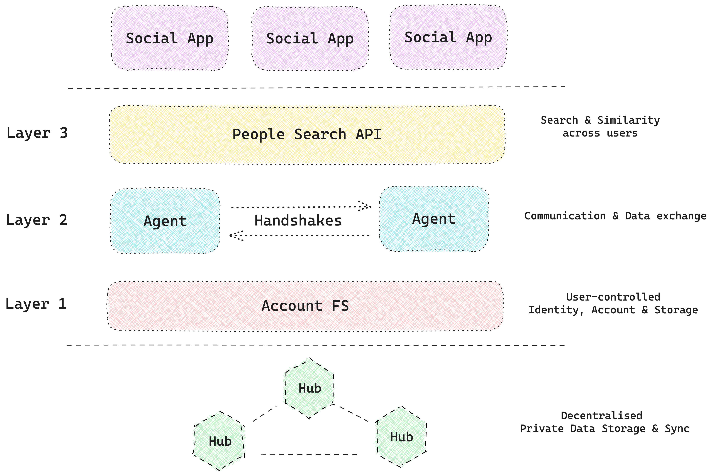

# Network

DCN (Decentralised Contact Network) is a peer-to-peer network, on which each participant gets a ‘Personal Information Store’ through which their ‘agents’ can exchange contact information via handshakes such as ‘join, ‘follow’, etc. DCN provides seamless people search to the participants across the network and also provides a low-code stack to developers for building user-centric social utility apps. 

## Architecture

The fundamental unit of DCN is **Account**, whose actions are executed through their **Agents**. Each device of an Account is represented on the network as an Agent.
- These agents manage the “**account-fs**” of the **account** across devices and apps. It is designed to store personal information such as 
    > **Profile, Contacts, Groups, Graphs, Calendar, Credentials and Notes**
- **Handshakes** are protocols for exchanging personal information amongst agents. Social interactions such as ‘**join** a community’, ‘**connect** with a member’, ‘**invite** a friend’ etc. are modelled as **Handshakes**, through which agents exchange personal information over an encrypted messaging layer.
- **People Search API** is a special-purpose search engine for agents to query contacts & graphs stored in account-fs and in turn enable search, similarity, and recommendations.



## MonoRepo overview

```
.
├── apps                    # Sample Applications built on the network
│   ├── rolodex/            # Implementation of a CRM app running live on testnet
│   └── ...
├── docs                    # Source repo for hosted Documentation
├── hub                     # Source repo for Decentralised Hub of the network
├── packages                # Packages to be used in building Hub and Apps
├── scripts                 # Scripts for admin activities
└── README.md
```
```
.
├── ...
├── packages/account-fs     # Core package to be used by every participant of the network
│   ├── agent               # Implementation of Agent of the network
│   │   ├── fs/             # Implementation of Account-fs storage (layer 1 from diagram)
│   │   ├── handshakes/     # Implementation of Handshake (layer 2 from the diagram)
│   │   └── ...
│   ├── people/             # Implementation of People Search API (layer 3 from the diagram)
│   ├── app.js              # Bootstrapping agent on an App server hosted in the cloud
│   ├── browser.js          # Bootstrapping an Account's Agent embedded in the browser
│   ├── hub.js              # Boostrapping network and storage for the Hub
│   └── ...                 # etc.
└── ...
```

## Local setup 

To bring up the 'rolodex' application, follow the below steps 
-  Run ```npm install``` at the project directory to install the dependencies.
-  Run ```npm start -w hub``` at the project directory to bring up the hub.
-  Run ```npm start -w rolodex 4000``` at the project directory to bring up the rolodex application on port 4000. The application will be up on http://localhost:4000/

Currently, 'rolodex' requires the 'hub' to be up as well for it to work. 

### Major Dependencies
- 'Hub' requires [Redis](https://redis.io/docs/install/install-redis/) to run, the assumption is that redis will run on port 6379. One can refer the 'package.json' file of 'hub' for the appropriate redis version to be installed.


## Start Building

* Read our [Whitepaper](https://shovelco.notion.site/Decentralised-Contact-Network-Summary-v0-4-6d8885c11cc9415d90f21a16fd007b93?pvs=4)
* Come join us on our [Discord](https://discord.gg/PmzsJeembE)
