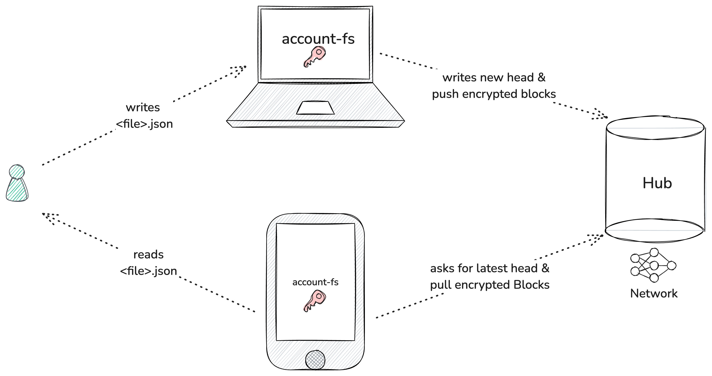

# Account-fs

Account-fs is a local-first encrypted file system, contented-addressed & synced to a network of decentralised nodes. 

It is designed to store personal information such as

> Profile, Contacts, Groups, Graphs, Calendar, Credentials and Notes
 

**User-controlled** 

- Each account on Creole has an associated account-fs. It acts as a personal information store, portable across apps and syncing across devices
- Users can selectively provide data access to different accounts.

**Local-first**

- The files are stored first on the device locally and synced in the background.

**Private**

- All the data is encrypted at rest and on-the-wire, ensuring privacy in an open network.
- The data is “encrypted at rest” with **`AES-GCM`** cipher suite. The encryption keys are stored locally with the agent. Hubs always store the encrypted data, which can only be decrypted with keys that are owned by the agent.