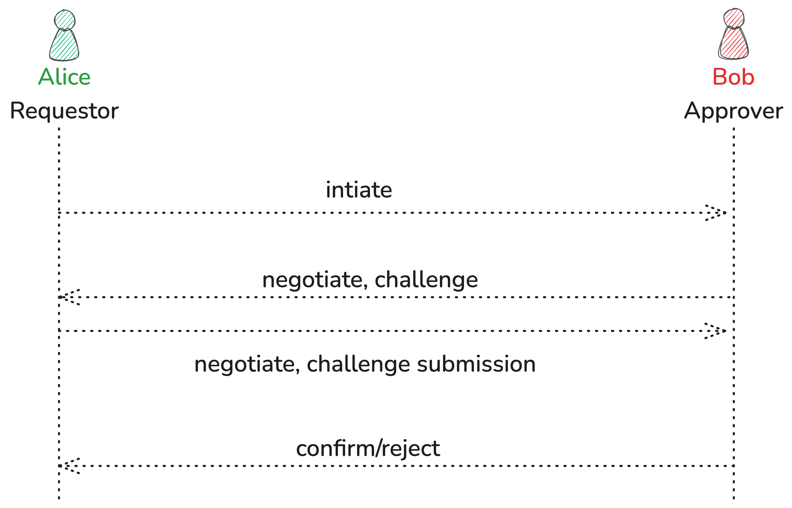

# Handshakes

Handshake is a 2-step bi-directional protocol. 

#### 1. Secure channel & Schema Negotiation

In the first step, an E2EE secure channel is established between the parties by exchanging symmetric keys & encrypting further messages with the shared key. A schema is negotiated for the data being shared in the second step. 

#### 2. Data Exchange

Depending on the nature of the handshake both parties share access to certain private files with each other 

> A variety of relationships can be modeled using the handshake primitive like “join”-ing a community, “sign”-ing up to an app or “connect”-ing with a user.

### Example: Joining a Community

While joining a community, a user account and a community account perform a handshake with the user being the `requestor` and the community being the `approver`. 

User and Community negotiate a profile schema, based on which the User submits a profile. The community then confirms, adds the user as a member, and shares the resulting member list.

### Transport & Channel

Handshake requires a WebSocket or WebRTC based transport channel. Either requestor & approver can create a direct p2p channel by discovering each other’s inbox via the hub Or the messages can be transported by another account acting as a broker.