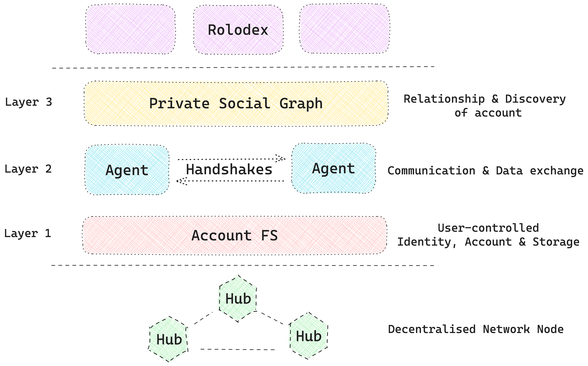

# Overview
Creole Network is a peer-to-peer network enabling user-controlled relationships on the internet.
Users form relationships with others when they “sign up” on an app, “join” a community or “connect” with someone on social apps. 

**[Rolodex](https://rolodex.social)** is the native contact app of Creole Network. All the relationships created across the apps on the network show up in a user’s rolodex.

On Creole Network every participant gets an **[Account](/accounts)** whose actions are executed through their **Agents**. Creole Network can be visualized as three conceptual layers

- **[Private Social Graph](/private_social_graph)** is the relationship and search layer. A relationship is created via handshakes between two Accounts via their Agents & stored as a graph with the user in the center. Users get to search through people and the profiles shared with them.
- **[Handshakes](/handshakes)** is a p2p data exchange and communication protocol between Accounts. 
A handshake establishes a relationship resulting in the mutual exchange of profiles between two accounts & giving permission to access data.
- **[Account-fs](/account_fs)** is the user-controlled, private data storage & sync layer for storing contacts and relationships

