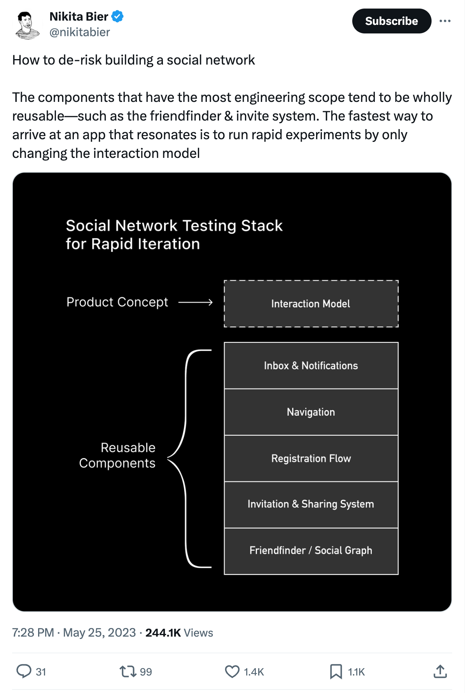
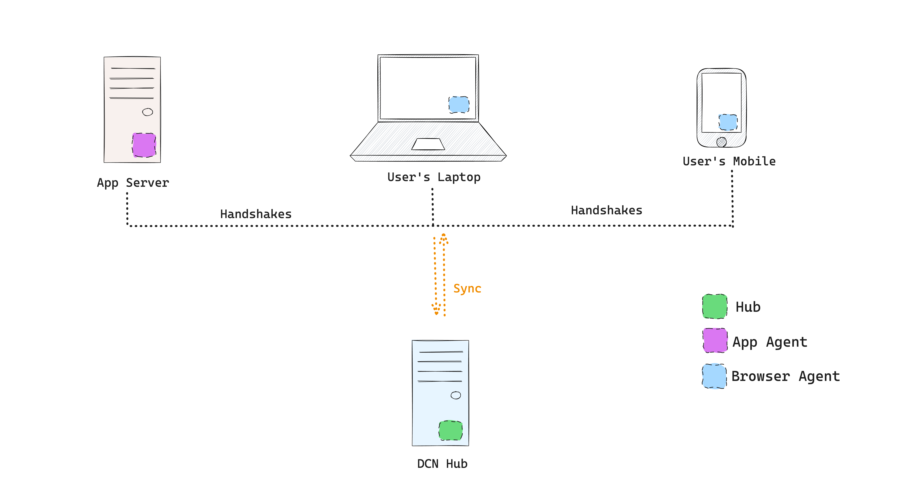

  <a href="#1-background">1. Background</a> 
  <a href="#2-introduction">2. Introduction</a> 
  <a href="#3-design">3. Design</a> 
  <a href="#4-network-topology">4. Network Topology</a> 
  <a href="#5-applications">5. Applications</a>

## 1. Background
Building a successful social app is a complex process of iterating fast over different ‘user interaction’ patterns. These interaction patterns define the app, which makes them unique. But these apps also [share many building blocks](https://twitter.com/nikitabier/status/1661733445163417601?s=20). Reusing these building blocks can accelerate these iterations.  

A new breed of social apps are emerging around the [social utility of a network](https://www.workingtheorys.com/p/social-utility), which got lost in the age of “social media”. A common trait of these apps is going beyond   monetisation - via data hoarding - by providing users control of their data.

Users controlling their data, shorten the time-to-market by reducing the cold-start issue of building critical mass of friends/ followers as the users themselves carry their social graph across apps. This user-control of data also protects app builders from impediments of success such as data compliance requirements for PII (Personally Identifiable Information).

## 2. Introduction
DCN (Decentralised Contact Network) is a peer-to-peer network, on which each participant gets a 'Personal Information Store' through which their ‘*agents’* can exchange contact information via handshakes such as ‘*join*, ‘*follow*’, etc. DCN provides seamless people search to the participants across the network and also provides a low-code stack to developers for building user-centric social utility apps.

## 3. Design

The fundamental unit of DCN is **Account**, whose actions are executed through their **Agents**. Each device of an Account is represented on the network as an Agent.

- These agents manage the “**account-fs**” of the **account** across devices and apps. It is designed to store personal information such as
    
> **Profile, Contacts, Groups, Graphs, Calendar, Credentials and Notes**

- **Handshakes** are protocols for exchanging personal information amongst agents. Social interactions such as ‘**join** a community’, ‘**connect** with a member’, ‘**invite** a friend’ etc. are modelled as **Handshakes**, through which agents exchange personal information over an encrypted messaging layer.
- **People Search API** is a special-purpose search engine for agents to query contacts & graphs stored in account-fs and in turn enable search, similarity, and recommendations.

The network can be visualised as three layers, with distinct capabilities and responsibilities, namely:

### **3.1 Account-FS**
User-Controlled Identity, Account & Storage Layer 

Account-fs is a user-controlled account system with a personal information store that is portable across apps and and also syncs across devices. It is local-first so [“You own your data, in spite of the cloud”](https://www.inkandswitch.com/local-first/).

All the data is encrypted at rest and on wire, ensuring privacy in an open network. Users can selectively provide data access to different apps. 

Account-fs is built on content-addressed data storage. It uses WNFS for providing an encrypted filesystem with locally running Helia nodes. These nodes are synced with the Hubs by the agents.

The data is “encrypted at rest” with `AES-GCM` cipher suite. The encryption keys are stored locally with the agent. Hubs always store the encrypted data, which can only be decrypted with keys that are owned by the agent.

### **3.2 Handshakes**
Communication & Data Exchange Layer

The agents can perform handshakes for accounts, through an E2EE messaging channel. Handshakes are used to acquire connections and contacts and share user personal information from account-fs with other users and apps. The network currently supports **Join**, **Relate**, **Invite** & **Link** handshakes

- **Join:** designed for `Joining an app, a community, or a directory`, where an account agent exchanges profile information with an app agent.
- **Relate:** designed for connecting two users on an app such as `adding a friend, following, or creating a connection.` Underneath, two account agents exchange contacts brokered by the app agent.
- **Invite:** used for inviting people from a user’s social graph to apps that they are using, or to the groups they have joined. Underneath, account agent sends an invite to another account agent from their social graph.
- **Link:** designed to provide multi-device (multi-agent) capability for an account.

Each handshake establishes session layer security by exchanging symmetric keys before transferring data.

### **3.3 People Search API**
Search and Recommendation Layer

People Search API are the APIs for finding accounts on the network or finding similarities between two accounts for matchmaking and recommendation.

These are utilized by the app builders for features such as 

- Finding the right contact/connection in your network in a context
- To indicate to users that they follow a person on X
- Recommended Connections/People to Follow
- Mutual Apps/Connections/Communities between users

## **4. Network Topology**

Network consists of agents and hubs with different capabilities, runtime environment and roles.

1. **Hub** is the full node of DCN, which is responsible for 
    - Being the `data sync layer` for all the accounts of the network
    - Naming registry for the accounts
2. Agents run in a hybrid runtime environment such as a web browser or a virtual machine in cloud.
    1. **Browser Agent** (Runs in the client browser)
        - local-first capabilities, storing and retrieving account’s owned data locally & syncing data with the hubs periodically through libp2p based channel
        - communication capabilities for `user<>user` and `user<>app` handshakes & messaging
    2. **App Agent** (Run on application server)
        - communication capabilities for `user<>app` handshakes & messaging

Each of these agents and hub runs an embedded Helia node to store data and make connections with each other.

## 5. Applications

A variety of social utility applications can be built using DCN:

- A `local-first PRM (personal-relationship manager)` for a user to store and operate on connections from multiple apps/networks and contacts.
- A `directory app` for communities to create and manage member-controlled profiles.
- A [Forever Contact App](https://www.windley.com/liveweb/forever/forever.shtml) that auto-updates the contact details when a contact changes their profile, forever.
- A Smart Form auto-filler which lets user auto-fill fields they have already filled elsewhere, such as their delivery address for all the e-commerce sites they purchase from.
- A user preference store (”user-owned cookies”) which they can carry across apps to kickstart personalisation without having to build a profile from scratch. Such as, dark mode on every website by default.
- A birthday reminder app for close friends and family

Let your imagination fly, and tell us on [our Discord](https://discord.gg/PmzsJeembE)

---